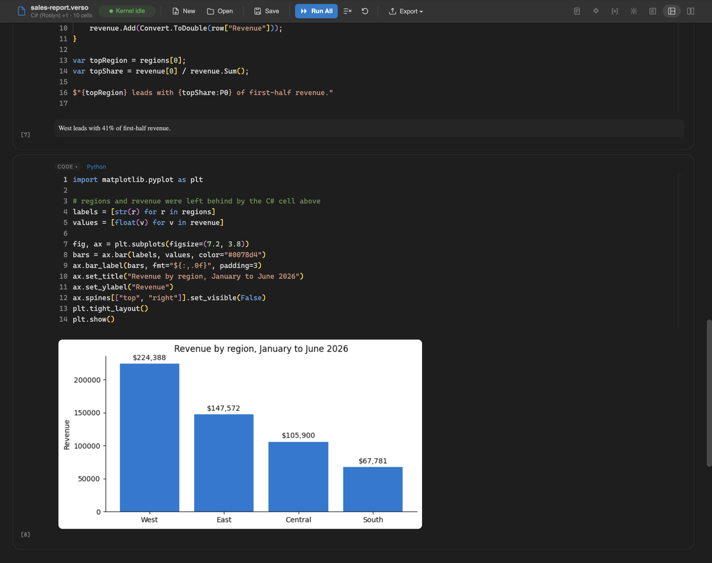
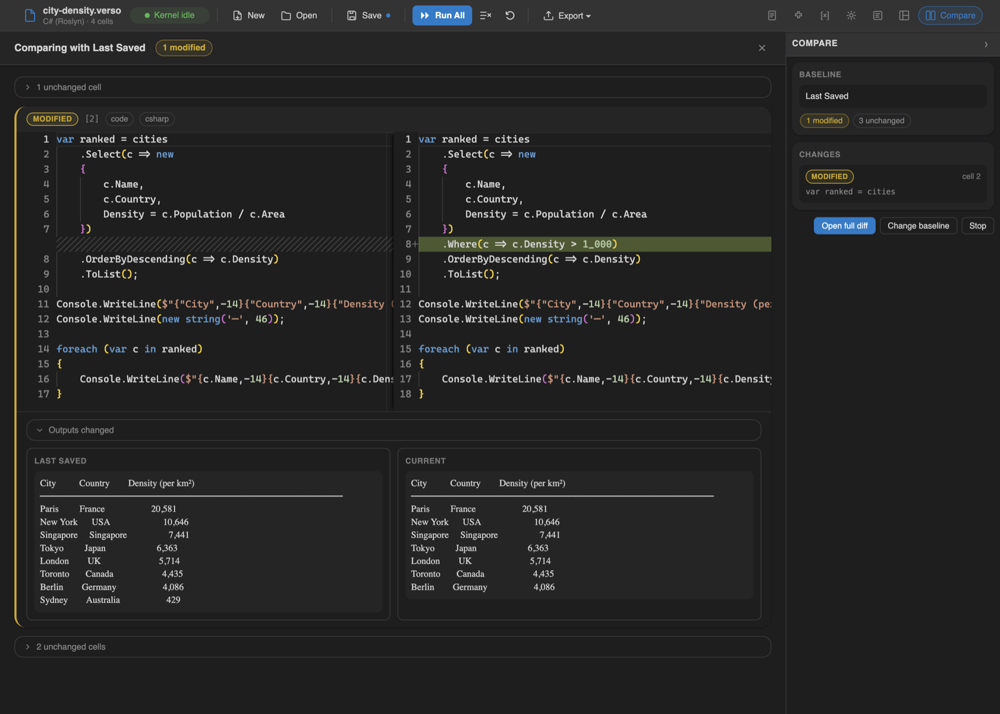

<div align="center">


<h1>Verso</h1>

<p><strong>Open-source interactive notebook platform and embeddable .NET execution engine.</strong></p>

<p>
  <a href="LICENSE.md"></a>
  <a href="https://dotnet.microsoft.com/download/dotnet/10.0"></a>
  <a href="https://github.com/DataficationSDK/Verso/actions/workflows/verso-ci.yml"></a>
  <a href="https://www.nuget.org/packages/Verso"></a>
  <a href="https://github.com/DataficationSDK/Verso/releases"></a>
  <a href="https://marketplace.visualstudio.com/items?itemName=Datafication.verso-notebook"></a>
</p>

<p>
  <a href="https://www.versonotebooks.com">Website</a>
  &nbsp;&middot;&nbsp;
  <a href="https://www.versonotebooks.com/gallery/">Gallery</a>
  &nbsp;&middot;&nbsp;
  <a href="https://www.versonotebooks.com/docs/">Documentation</a>
  &nbsp;&middot;&nbsp;
  <a href="https://marketplace.visualstudio.com/items?itemName=Datafication.verso-notebook">VS Code extension</a>
  &nbsp;&middot;&nbsp;
  <a href="https://www.versonotebooks.com/release-notes.html">Release notes</a>
</p>

</div>



## Quick Start

**In VS Code**, install the extension from the [Marketplace](https://marketplace.visualstudio.com/items?itemName=Datafication.verso-notebook), then open any `.verso`, `.ipynb`, or `.dib` file:

```bash
code --install-extension Datafication.verso-notebook
```

**In the browser**, install the CLI as a .NET global tool and launch the editor:

```bash
dotnet tool install -g Verso.Cli
verso serve
```

Requirements: the VS Code extension needs the [.NET runtime, version 8.0 or later](https://dotnet.microsoft.com/download/dotnet) and offers to install it for you if it is missing; the `verso` CLI needs the [.NET SDK](https://dotnet.microsoft.com/download/dotnet/10.0) for `dotnet tool install`. [Node.js 18+](https://nodejs.org/) and [Python 3.8 or newer](https://www.python.org/downloads/) are optional; they enable the JavaScript/TypeScript and Python kernels (JavaScript falls back to the pure .NET Jint interpreter when Node.js is absent).

## Why Verso

Microsoft deprecated Polyglot Notebooks on February 11, 2026, and .NET Interactive, the engine that powered it, followed the same path. Together they were the primary way to run interactive C#, F#, PowerShell, and SQL in a notebook. Their deprecation left a gap in the .NET ecosystem: no maintained notebook platform, and no maintained embeddable execution engine.

Verso fills both roles.

**As a notebook platform**, Verso runs in VS Code or any browser, ships with IntelliSense and variable sharing across every language it supports, and imports existing `.ipynb` and `.dib` files. If you used Polyglot Notebooks, the experience will feel familiar.

**As an engine**, the core is a headless .NET library with no UI dependencies. It provides multi-language execution, an extension host, a variable store, and a layout manager through a clean set of public interfaces. If you embedded .NET Interactive in a tool, service, or workflow, the Verso engine serves the same purpose with a fully extensible architecture. Reference the NuGet package, wire up a `Scaffold`, and you have a programmable notebook runtime in any .NET application.

The architecture is built on one principle: every feature is an extension, and every extension uses the same public interfaces available to anyone. The C# kernel, the dark theme, and the dashboard layout all ship as extensions with no special access to engine internals. If a built-in feature needs an internal API to work, the interfaces are incomplete.

## Features

### Code Execution with IntelliSense


Every language kernel answers completions and hover from a real language service rather than by text matching: Roslyn for C#, FSharp.Compiler.Service for F#, a live runspace for PowerShell, and your own interpreter for Python. Kernels also compute diagnostics ahead of execution, which hosts and tools reach through `ILanguageKernel.GetDiagnosticsAsync`; errors from a run are reported as cell output.

NuGet packages are referenced inline with `#r "nuget: PackageName/Version"`, and custom package sources are supported with `#i "nuget: <url>"`. Python uses `#!pip` for package management, and JavaScript uses `#!npm` for npm packages. State persists across cells within each kernel, and variables are shared across kernels through a central variable store.

### Layouts

The same notebook can be read as a linear document, rearranged into a 12-column grid dashboard, or presented as a read-only flow with the editor chrome stripped away. Switch between them at runtime; the arrangement is saved in the `.verso` file, so a notebook opens the way you left it.

In the dashboard, drag cells to reposition them, resize with handles, and hide the plumbing so only the result is on screen.


Presentation mode shows the same cells as a document: source and result, no run buttons, no badges, nothing to click by accident.


Layouts are an extension point like everything else. Custom layout engines plug in through the same public interfaces as the built-ins.

### Panels

A sidebar of panels sits beside the notebook, each opened from a pill in the toolbar: Metadata, Extensions, Variables, Settings, Properties, View, and Compare. Only the open panel shows its label, so the row stays out of the way.

Panels are an extension point too. An extension implements `INotebookPanel` and contributes its own panel next to the built-ins, with the same vocabulary and the same styling as everything that ships.


The Extensions panel doubles as a marketplace. Search NuGet, install into the notebook, pin a version, or sideload a package from disk, then see what each installed package actually contributed. See the [managing extensions guide](docs/guides/managing-extensions.md).

### Notebook Comparison

Compare the open notebook, unsaved edits included, against the last saved file, git HEAD, any branch, tag, or commit, or another notebook file on disk. Because every cell in a `.verso` file has a stable identity, the diff distinguishes an edited cell from a removed-plus-added pair and recognizes cells that merely moved. Modified cells show side-by-side source comparison, and when outputs changed, the old and new rendered outputs (tables, charts, HTML) appear next to each other. Notebook-level settings changes such as the active layout, theme, and parameters are summarized at the top.



Comparison runs from the Compare panel and stays on while you keep working, so changed cells stay marked in the notebook after the panel is closed. See the [comparing notebooks guide](docs/guides/comparing-notebooks.md).

### Notebook Parameters

A parameters cell declares typed inputs with defaults, rendered as a form at the top of the notebook. The same notebook then runs unattended with `verso run pipeline.verso --param region=us-east`, which is what makes one file work both interactively and in a scheduled job. See the [notebook parameters guide](docs/guides/notebook-parameters.md).

### Python on Your Own Interpreter

Python cells run in a separate process against a CPython installation already on your machine, 3.8 or newer, so an active virtual environment or conda environment is picked up and its packages are simply there. `#!python` reports what was found and switches interpreters for the session, and `--python <path>` pins one for `verso run`, `verso repl`, and `verso serve`. matplotlib figures render inline, and widgets built on `ipywidgets` or `anywidget` are live: moving a control reaches the interpreter, and `#!bind` shares a control's value with the notebook's other languages. See the [Python interpreters guide](docs/guides/python-interpreters.md), the [Python packages guide](docs/guides/python-packages.md), and the [interactive widgets guide](docs/guides/interactive-widgets.md).

### Database Connectivity

Verso.Ado provides provider-agnostic SQL connectivity through ADO.NET. Connect to any supported database, execute queries with paginated result tables, inspect schema, and scaffold EF Core DbContext classes at runtime. SQL results are shared to the variable store for use in C#, F#, and other cells. See the [database connectivity guide](docs/guides/database-connectivity.md) for connection setup, provider support, EF Core scaffolding, and CI/CD pipeline examples.

### HTTP Requests

Verso.Http uses `.http` file syntax (the same format supported by VS Code REST Client and JetBrains HTTP Client). Features include variable interpolation, dynamic variables, named request chaining, and cross-kernel integration where response data is shared to C#, F#, and other cells.

### JavaScript and TypeScript

Verso.JavaScript provides full JavaScript and TypeScript execution in notebook cells. When Node.js is available, cells run in a persistent subprocess with access to `require()`, dynamic `import()`, top-level `await`, and npm packages installed via the `#!npm` magic command. In environments without Node.js, the JavaScript kernel falls back to Jint, a pure .NET ES2024 interpreter with no external dependencies. TypeScript cells are automatically transpiled using the TypeScript compiler API (auto-installed on first use) and share the same execution environment and variable scope as JavaScript cells.

### Rich Content Cells

Markdown (rendered via Markdig), raw HTML, and Mermaid diagram cells all support `@variable` substitution from the shared variable store, enabling dynamic documents that update when data changes. See the [Mermaid diagrams guide](docs/guides/mermaid-diagrams.md) for diagram types, variable-driven charts, and theming.

### Themes

Three built-in themes (Light, Dark, High Contrast) are hot-swappable at runtime. The High Contrast theme meets WCAG 2.1 AA contrast requirements. In VS Code, the notebook theme automatically follows your editor theme.

### Interface Language

The notebook interface, the toolbar and panels, the kernel messages that land in cell output, and the CLI are translated into German, Spanish, Japanese, and Simplified Chinese. Verso follows the system or the editor on its own; `verso.language` and `--language` override it, and `VERSO_LANGUAGE` sets it once for a container or a pipeline. Only the words change: numbers and dates keep the machine's own formatting, so a language never alters what a cell computes. See the [interface language guide](docs/guides/interface-language.md).

### GitHub Copilot Integration

In VS Code, a `@verso` chat participant answers questions about the notebook in front of you, and while a notebook is open, twenty language model tools let agent mode create, edit, run, and inspect cells directly. Copilot works against the real notebook rather than a text approximation of it.

### Import from Jupyter and Polyglot Notebooks

Open any `.ipynb` or `.dib` file and Verso converts it automatically. Polyglot Notebook patterns like `#!fsharp`, `#!connect`, and `#!sql` are mapped to native Verso cells during import. By default, saving writes to a sibling `.verso` file and leaves the original untouched. To save `.ipynb` notebooks back to `.ipynb` (cell outputs preserved), enable the `verso.preserveOriginalFormat` setting in VS Code, or pass `--preserve-format` to `verso repl` / `verso serve`.

### Markdown Notebooks

A plain `.md` file is a notebook. Fenced code blocks tagged with a language Verso recognizes become executable cells; prose, untagged fences, and code samples in other languages stay as prose. Saving writes plain Markdown back to the same file, preserving your fence style exactly, so the document still renders on GitHub and reviews cleanly in a pull request. Cell outputs are not persisted in this format. See [Markdown Notebooks](docs/guides/markdown-notebooks.md).


### Sharing a Notebook

Any notebook in a public repository can be read as a page, with its saved outputs, by changing the host in its URL. `github.com/owner/repo/blob/main/analysis.verso` becomes `www.versonotebooks.com/share/github/owner/repo/blob/main/analysis.verso`, and everything after the host stays as it was. GitLab and gists work the same way, `.verso`, `.ipynb`, and `.md` files are all supported, and nothing is uploaded or executed. Each page offers an "Open in Verso" badge to paste into your README. See [Sharing a Notebook](docs/guides/sharing-a-notebook.md).

## Languages

| Language | IntelliSense | Variable Sharing |
|----------|:------------:|:----------------:|
| C#         | Yes | Yes |
| F#         | Yes | Yes |
| JavaScript | Yes* | Yes |
| TypeScript | Yes* | Yes |
| PowerShell | Yes | Yes |
| Python     | Yes | Yes |
| SQL        | Yes | Yes |
| HTTP       | Yes | Yes |

\* IntelliSense for JavaScript and TypeScript is provided by Monaco's built-in language services rather than the kernel.

Markdown, HTML, and Mermaid ship as rich content cell types rather than language kernels; see [Rich Content Cells](#rich-content-cells).

## Command Line

Verso ships as a .NET global tool. Beyond launching the editor, the CLI runs notebooks headlessly, hosts a terminal REPL, and converts between formats, so the same notebook works interactively and in CI.

```bash
# Launch the Verso editor in your browser
verso serve

# Open a specific notebook
verso serve my-notebook.verso

# Run a notebook headlessly
verso run pipeline.verso --param region=us-east --output json

# Convert a Jupyter notebook to Verso format
verso convert notebook.ipynb --to verso

# Start an interactive REPL (C# by default; switch with .kernel fsharp, .kernel python, ...)
verso repl

# Export a notebook through a registered ExportMenu action
verso export notebook.verso --format html --output out.html
```

| Command | Purpose |
|---------|---------|
| `verso serve` | Launch the Verso editor as a local web server |
| `verso run` | Execute a notebook headlessly and stream outputs |
| `verso repl` | Interactive REPL hosted in the terminal, backed by the same kernels and extensions as the editor |
| `verso convert` | Convert between `.verso`, `.ipynb`, and `.dib` formats |
| `verso export` | Export a notebook via an `ExportMenu` toolbar action (HTML, Markdown, …) |
| `verso info` | Display CLI version, runtime, and extension details |

`verso run` supports typed parameters (`--param name=value`), JSON output for CI integration, selective cell execution, and fail-fast mode. `verso repl` supports completion, persistent history, multi-line cell submission (blank-line to submit), and meta-commands like `.kernel`, `.vars`, `.save`, `.load`, and `.export`. See the [CLI README](src/Verso.Cli/README.md) for the full option reference, meta-command list, exit codes, and CI/CD examples.

## Architecture

Verso is split into three layers. The engine knows nothing about the UI. The UI knows nothing about the host environment. Extensions work identically everywhere.

```
+-----------------------------------------------------------+
|  Front-Ends                                               |
|  +---------------------+  +--------------------------+    |
|  |  VS Code Extension  |  |  Blazor Server Web App   |    |
|  |  (Blazor WASM       |  |  (verso serve, or        |    |
|  |   inside a webview) |  |  dotnet run Verso.Blazor)|    |
|  +----------+----------+  +-------------+------------+    |
|             |                           |                 |
|  +----------------------------------------------------+   |
|  |  Shared UI (Razor Class Library)                   |   |
|  |  Monaco editor, panels, toolbar, theme provider    |   |
|  +----------------------------------------------------+   |
|                                                           |
|  +----------------------------------------------------+   |
|  |  CLI (verso run / verso convert)                   |   |
|  |  Headless execution, format conversion, CI/CD      |   |
|  +----------------------------------------------------+   |
+-----------------------------------------------------------+
                           |
+-----------------------------------------------------------+
|  Verso Engine (headless .NET library, no UI)              |
|  Scaffold - Extension Host - Execution Pipeline           |
|  Layout Manager - Theme Engine - Variable Store           |
+-----------------------------------------------------------+
                           |
+-----------------------------------------------------------+
|  Verso.Abstractions                                       |
|  Pure interfaces, zero dependencies                       |
|  The only package extension authors need to reference     |
+-----------------------------------------------------------+
```

**Front-ends** provide the user experience. Blazor Server talks to the engine directly, in-process. VS Code runs Blazor WebAssembly in a webview, communicating with a host process over JSON-RPC. Both share the same Razor components so the notebook experience is identical. The CLI drives the engine headlessly for CI pipelines and automated workflows.

**The engine** is a headless .NET library. `Scaffold` orchestrates a notebook session: cell management, kernel dispatch, execution, cross-kernel variable sharing, and subsystem coordination. Every language kernel, theme, layout, and formatter ships as an extension using the same public interfaces available to third-party authors.

**Verso.Abstractions** contains only interfaces and the `[VersoExtension]` attribute. It is the sole dependency for extension authors and has zero transitive dependencies.

For a deeper look at each layer, see the [architecture documentation](docs/architecture/overview.md).

## Extension Model

A focused set of interfaces in `Verso.Abstractions` defines every point of extensibility: language kernels, cell renderers, cell types, cell property providers, notebook panels, toolbar actions, data formatters, magic commands, themes, layouts, serializers, notebook migrations, post-processors, and cell and layout interaction handlers. Extensions can also implement `IExtensionSettings` to expose configurable settings in the UI.

Third-party extensions load in their own `AssemblyLoadContext`, collectible and unloadable. Your extension references only `Verso.Abstractions` and works across every front-end without modification.

```bash
dotnet new verso-extension -n MyExtension
```

Verso includes a `dotnet new` template, a testing library (`Verso.Testing`), and sample extensions in the repo. For the full interface reference and extension host internals, see the [extension documentation](docs/extensions/) and [extension host architecture](docs/architecture/extension-host.md).

## What Ships Out of the Box

| Category | Included |
|----------|----------|
| **Kernels** | C# (Roslyn), F# (FCS), JavaScript (Node.js / Jint), TypeScript, PowerShell, Python (your own interpreter, run out of process), HTTP |
| **Cell Types** | Code, Markdown, HTML, Mermaid, Parameters, SQL, HTTP |
| **Themes** | Light, Dark, High Contrast (WCAG 2.1 AA) |
| **Layouts** | Notebook (linear), Dashboard (12-column CSS grid), Presentation (read-only flow) |
| **Panels** | Metadata, Extensions, Variables, Settings, Properties, View, Compare |
| **Magic Commands** | `#!time`, `#!nuget`, `#!pip`, `#!npm`, `#!python`, `#!extension`, `#!restart`, `#!about`, `#!import`, `#!sql-connect`, `#!sql-disconnect`, `#!sql-schema`, `#!sql-scaffold`, `#!http-set-base`, `#!http-set-header`, `#!http-set-timeout` |
| **Toolbar Actions** | Run Cell, Run All, Clear Cell Output, Clear Outputs, Restart Kernel, Switch Layout, Switch Theme, Export HTML, Export Markdown, Export CSV, Export JSON, Export Verso |
| **Data Formatters** | Primitives, Collections (HTML tables), Objects (expandable graph, bounded so framework internals cannot exhaust the output budget), HTML, Images, SVG, Exceptions, F# types, SQL result sets |
| **Serializers** | `.verso` (native JSON, read/write), `.ipynb` (read/write, write opt-in), `.md` (read/write, plain Markdown, no outputs), `.dib` (read only) |

## The `.verso` File Format

JSON-based, human-readable, and diff-friendly:

```json
{
  "verso": "1.0",
  "metadata": {
    "defaultKernel": "csharp",
    "activeLayout": "notebook",
    "preferredTheme": "verso-light"
  },
  "cells": [
    {
      "id": "...",
      "type": "code",
      "language": "csharp",
      "source": "Console.WriteLine(\"Hello from Verso\");",
      "outputs": [...]
    }
  ],
  "layouts": {
    "dashboard": {
      "cells": {
        "cell-id": { "row": 0, "col": 0, "width": 6, "height": 4 }
      }
    }
  }
}
```

## Documentation

In this repository:

- [Architecture](docs/architecture/overview.md): the engine, front-ends, and extension host in depth
- [Guides](docs/guides/): database connectivity, Mermaid diagrams, notebook comparison, and more
- [Extension authoring](docs/extensions/): the full interface reference and walkthroughs
- [Migration](docs/migration/): coming from Polyglot Notebooks, Jupyter, or Papermill
- [CLI reference](src/Verso.Cli/README.md): every command, option, meta-command, and exit code
- [Known issues](KNOWN-ISSUES.md): what is currently broken and what to do about it

On [versonotebooks.com](https://www.versonotebooks.com):

- [Gallery](https://www.versonotebooks.com/gallery/): notebooks you can read in the browser and download to run
- [Share a notebook](https://www.versonotebooks.com/share/): read any notebook from a public repository, outputs included
- [Documentation](https://www.versonotebooks.com/docs/): the same guides, rendered and searchable
- [API reference](https://www.versonotebooks.com/api/): generated from the public API surface
- [Release notes](https://www.versonotebooks.com/release-notes.html): what changed in each version

## Building from Source

### Run in the Browser

```bash
git clone https://github.com/DataficationSDK/Verso
cd Verso
dotnet build Verso.sln
dotnet run --project src/Verso.Blazor
```

### Build the VS Code Extension

```bash
dotnet build src/Verso.Host
cd vscode
npm install
npm run build:all
npx vsce package --skip-license
```

Install the `.vsix` file, then open any `.verso` file. Use **Open With...** to import `.ipynb` or `.dib` files.

### Run the Tests

```bash
dotnet test Verso.sln
```

## Contributing

Contributions are welcome. Open an issue to discuss what you'd like to work on. Verso accepts contributions under the [Developer Certificate of Origin](https://developercertificate.org/); see [CONTRIBUTING.md](CONTRIBUTING.md) for the sign-off workflow.

## License

[MIT](LICENSE.md)

Verso is a Datafication project.
