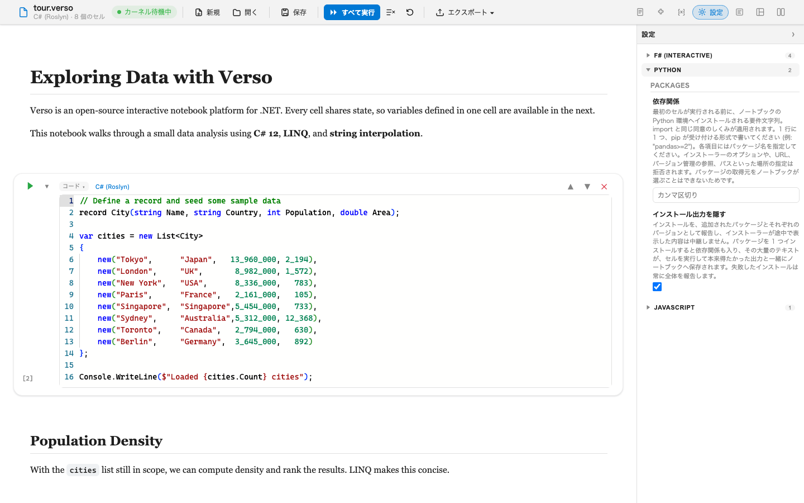

# Interface Language

Verso's interface is written in English and translated into German, Spanish, Japanese, and Simplified Chinese. The translation covers what Verso itself draws: the notebook interface, the toolbar and panels, the messages a kernel puts in a cell's output, and the command-line tool. What your notebook prints is your own, and Verso never rewrites it.



| Tag | Language |
|-----|----------|
| `en` | English |
| `de` | Deutsch |
| `es` | Español |
| `ja` | 日本語 |
| `zh-Hans` | 简体中文 |

Translations ship inside Verso, so nothing is downloaded and no account or key is involved.

## Choosing a language

Every host asks the same question in its own way and answers it the same way. The first of these that names a language Verso has, wins:

| Order | Source | Where it comes from |
|-------|--------|---------------------|
| 1 | Explicit request | `--language` on the command line, or `verso.language` in VS Code |
| 2 | Environment override | The `VERSO_LANGUAGE` environment variable |
| 3 | Operating system | The system's own interface language |
| 4 | English | The language every string is written in |

A tag that names a region falls back to the language: `de-AT` finds German, and `zh-CN` finds Simplified Chinese. A tag Verso does not have falls through to the next source rather than failing, so a misspelling costs you the translation and nothing else.

## In VS Code

`verso.language` sets the language of the notebook interface and of the kernel messages that appear in cell output. It defaults to `Auto-detect`, which follows the editor's own display language.

```jsonc
"verso.language": "ja"
```

There is a limit worth knowing before you go looking for the setting that fixes it. Entries in menus, command names in the Command Palette, and the descriptions of these settings all come from the editor, which draws them in its display language and gives no extension a way to override it. So a workbench set to English and `verso.language` set to Japanese will show **Compare** in the Command Palette and the Compare panel inside the notebook in Japanese, at the same time. That is the intended behaviour and not a missed string.

A change applies the next time a notebook is opened. The interface is a WebAssembly application that takes its language when it starts, and the host process behind it is launched with the language on its command line, so neither can be re-languaged without starting again. Reloading whatever is already open would throw away unsaved work to change a menu.

## From the terminal

`--language` is accepted by every command, and before the command name as well, so help text comes out in the language you asked for:

```bash
verso --language de --help
verso run pipeline.verso --language ja
verso repl --language es
verso serve --language zh-Hans
```

The command-line library Verso is built on writes its own usage headings and its own parse errors, and does not offer them for translation, so `Usage:`, `Options:`, and a message about a missing required argument stay in English whatever you ask for.

## In a container or a pipeline

`VERSO_LANGUAGE` sets the language once for everything Verso runs, which is easier than adding an option to every invocation:

```bash
export VERSO_LANGUAGE=de
verso run pipeline.verso
```

An explicit `--language` still wins over it, so a single run can differ without the variable being changed.

```dockerfile
ENV VERSO_LANGUAGE=ja
```

If you parse Verso's output in a pipeline, the parts you would parse are not translated. The `[stderr]` and `[error]` tags a run writes, and the status values in the document `--output json` produces, stay in English exactly so that setting a language cannot break a script.

## Serving to a browser

`verso serve` with no `--language` lets each browser ask, through the `Accept-Language` header it already sends, so two people opening the same server can read it in two languages. `verso serve --language de` pins it instead, and every browser gets German.

```bash
verso serve                      # each browser is asked
verso serve --language de        # everybody gets German
```

## Numbers and dates

Choosing a language translates words. It does not change how numbers, dates, and currency are written, because that would change your results rather than translate the interface: the same cell would print `3.14` on one machine and `3,14` on another, and that difference would be saved into the notebook file.

The one place both move together is the VS Code notebook interface, where the browser runtime takes a single culture for both and offers no way to split them. Cells there still run in the host process, which keeps its own formatting, so what a cell prints is unaffected.

## What stays in English

Four kinds of text are deliberately never translated, and each is marked as such in the source:

- **Anything a model reads rather than a person.** The chat participant's instructions and the descriptions of the tools it can call. Translating them changes which tool gets chosen without changing anything you see.
- **Anything a script reads rather than a person.** The output tags and JSON status values described above.
- **Text that only a fault produces.** Log lines and guards against programmer error stay searchable, so a stack trace pasted into an issue still matches a search made in another language.
- **The shape of the protocol.** The editor and the host talk over a small JSON-RPC surface, and a malformed request is a fault in code rather than something a reader can act on.

The line between the last two and everything else is whether you can do something about the message. A package that would not download, a value that does not fit the type its parameter declares, a connection that has since closed: all translated. A cell id that does not exist: not.

## Extensions

An extension can follow the interface language too: the host sets the language it is answering in before it calls into one, so an extension that keeps its strings in an ordinary .NET resource file answers in the same language as the notebook around it. The five showcase extensions do, in all five languages. An extension that has not been translated stays in English. Authors will find the pattern in the [Localization](../extensions/localization.md) guide.

## Adding a language

Translations are ordinary files in the repository, so a new language is a pull request rather than a release. The `build/i18n` directory holds the tooling and a README covering the whole route: add the tag to the shipped list in four places, export the strings a language is missing, translate them by hand or against an API, and merge them back. The merge refuses a translation that dropped a placeholder, came back empty, or names a string English does not have.

Two development aids are worth knowing about if you work on this. `check.py` compares every language against the English and reports anything that has drifted; it runs in continuous integration and needs no key and no network. And `qps-Ploc` is a generated pseudo-language in which every translated string appears accented and bracketed, so running the interface in it shows at a glance which strings were never moved into a resource file and where a longer translation would be clipped:

```bash
verso serve --language qps-Ploc
```

It is deliberately absent from the `verso.language` dropdown, because it is a development aid rather than a language. Set it by hand to use it in the editor.

## See also

- [CLI Reference](cli-reference.md)
- [Getting Started](getting-started.md)
