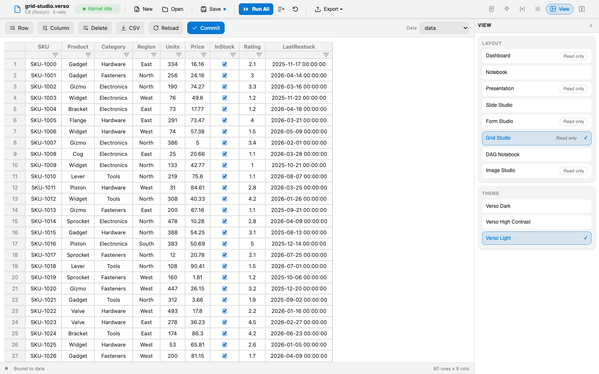

# Showcase Extensions

A layout decides how a notebook's cells are arranged and rendered, and it is an extension like any other. That sentence is easy to write and hard to believe, so the Verso repository carries five samples that make the case in the only way that really works: by being installable, running against the public interfaces, and turning a notebook into something you would not have guessed a notebook could be.

Each of the five is a NuGet package. Each references `Verso.Abstractions` and nothing else. Each is MIT-licensed source you can read end to end in an afternoon. Between them they cover the whole range of what the layout system allows, from a few chips added above each cell to a complete image editor with its own document model.



Once installed they appear in the **View** panel's layout list beside Notebook, Dashboard, and Presentation, with nothing marking them as the newcomers. That is the whole argument in one screenshot: the built-in layouts are extensions too, and these were written against the same interfaces.

## The five

| Extension | What the notebook becomes | Package |
|---|---|---|
| [DAG Notebook](dag-notebook.md) | A reactive notebook: cells linked by the variables they share, and a change that cascades downstream | `Verso.Showcase.DagNotebook` |
| [Slide Studio](slide-studio.md) | A slide editor with a filmstrip, a split editor and output view, and a full-screen presenter | `Verso.Showcase.SlideStudio` |
| [Grid Studio](grid-studio.md) | An editable spreadsheet bound to a kernel variable, with your edits written back as data | `Verso.Showcase.GridStudio` |
| [Form Studio](form-studio.md) | A dashboard you build by dragging, whose inputs drive the notebook's own code | `Verso.Showcase.FormStudio` |
| [Image Studio](image-studio.md) | A layered image compositor with a canvas, a layer stack, and a tool palette | `Verso.Showcase.ImageStudio` |

## Inline and isolated

Layouts come in two kinds, and the showcase deliberately holds examples of both.

An **inline** layout arranges the host's real cell components. The editor in a Slide Studio workspace is the same Monaco editor, with the same run button and the same IntelliSense, that you would be typing into in the notebook layout. DAG Notebook and Slide Studio are inline, which is why both keep everything the notebook could already do and add to it rather than replace it.

An **isolated** layout renders inside a sandboxed frame and draws its own surface from scratch. That is what lets Grid Studio ship a spreadsheet, Form Studio ship a charting canvas, and Image Studio ship an image editor, each with vendored third-party JavaScript, without any of it reaching the rest of the application. An isolated layout talks to the notebook over a defined bridge: it reads and writes kernel variables, receives updates when they change, and persists its own document into the notebook file.

Neither kind is privileged. The two channels an isolated layout uses are public, and the interfaces both kinds implement are the ones documented in the [Layout Authoring Guide](../extensions/layouts.md).

## Opening one

Each showcase has a sample notebook beside it in the repository, and each of those notebooks declares its package as a required extension. Open the notebook in any Verso host and the extension is fetched from NuGet, loaded, and made active before the first render, so the notebook paints in its intended layout with nothing to configure.

To use one on a notebook of your own, install it from the **Extensions** pane (searching `Verso.Showcase` finds all five) and pick it from the layout picker in the **View** panel. Installing an extension asks you to trust it first, which is covered in [Managing Extensions](../guides/managing-extensions.md).

## Building from source

Each sample builds standalone against the local `Verso.Abstractions` project, so a clone plus the .NET SDK is enough:

```bash
dotnet build samples/showcase/grid-studio/src/Verso.Showcase.GridStudio
```

Load the result into a notebook with a `#!extension` line naming the built assembly, then switch layouts. The path resolves relative to the notebook's folder:

```
#!extension ./src/Verso.Showcase.GridStudio/bin/Debug/net8.0/Verso.Showcase.GridStudio.dll
```

This is the loop to work in if you are reading a sample in order to write your own layout: edit, build, reopen, look.

## What they share

Beyond the interfaces, the five agree on a handful of habits worth copying.

They theme through the host's `--verso-*` CSS variables rather than asking what the current theme is, so they re-color when you switch themes, including themes generated from your active VS Code theme, and they never need to know a palette by name.

They persist their own state into the notebook file through layout metadata. A dashboard's widgets, a deck's slide flags, a compositor's layer stack, and a grid's binding all travel in the `.verso` file and come back when it is reopened. No sidecar files, no host changes.

They read data by reflection rather than by reference. Grid Studio and Form Studio both work with `DataBlock` values from `Datafication.Core`, and neither references that package: they read whichever assembly the kernel loaded with `#r "nuget: ..."`, which is what keeps them working however that assembly arrived.

They follow the interface language. Each keeps its strings in its own resource file, translated into the same four languages as Verso itself, and the three isolated layouts hand their strings to their frames on mount. Open one with `verso serve --language de` and its header bar, tooltips, and properties panel come up in German with the rest of the notebook. The [Localization](../extensions/localization.md) guide walks through what they do.

And they are samples, not products. The code is meant to be read, and each one is small enough that reading it is a reasonable afternoon.

## See also

- [Layouts and Showcase Extensions](../guides/layouts.md)
- [Layout Authoring Guide](../extensions/layouts.md)
- [Managing Extensions](../guides/managing-extensions.md)
